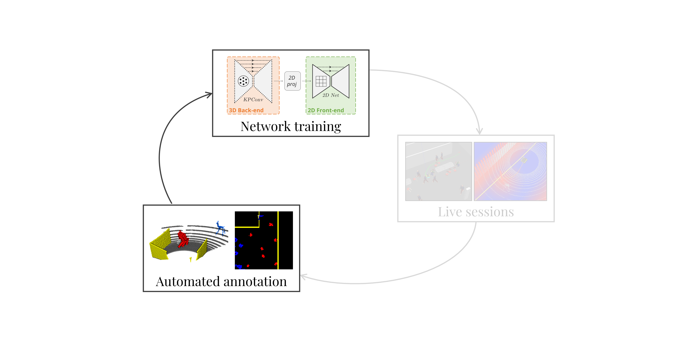

# Deep-Collison-Checker

In this repository, we share the implementation of the paper [Learning Spatiotemporal Occupancy Grid Maps for Lifelong Navigation in Dynamic Scenes](https://arxiv.org/abs/2108.10585). This code is a minimalist version made with two objectives:
 - Easily reproduce the results presented in the paper
 - Possiblity to apply the network to other datasets

 As shown in the next figure, in this repo, we provide the code for our **automated annotation** and **network training**. The whole simulation is ignored, and we provide preprocessed data instead. 




## Setup

For convenience we provide a Dockerfile which builds a docker image able to run the code. Please refer to [Docker/README.md](./Docker) for detailed setup instructions

## Data

### Preprocessed data for fast reproducable results

We provide preprocessed data coming from our simulator. Simply download this [zip file]() and extract its content in the `Data` folder. 

You should end up with the folder `Data/Simulation/simulated_runs`, containing 20 dated folders. The first one contains the mapping session of the environment. The rest are sessions performed among Bouncers.

In the folder `Data/Simulation/slam_offline`, we provide the preprocessed results of the mapping session. A `.ply` file containing the pointmap of the environment.

Eventually the folder `Data/Simulation/calibration` contains the lidar extrinsec calibration.


### Instructions to apply on a different dataset

If you want to use our network on your own data, the first simple solution is to reproduce the exact same format for your own data. 

1) modify the calibration file according to your own lidar calibration. 
2) Create a file `Data/Simulation/slam_offline/YOUR_DATE/map_update_0001.ply`. See our [pointmap creation code](SOGM-3D-2D-Net/datasets/MyhalCollision.py#L1724) for how to create such a map. 
3) Organise every data folder in `Data/Simulation/simulated_runs` as follows:

```
    #   YYYY-MM-DD-HH-MM-SS
    #   |
    #   |---logs-YYYY-MM-DD-HH-MM-SS
    #   |   |
    #   |   |---map_traj.ply         # (OPTIONAL) map_poses = loc_poses (x, y, z, qx qy, qz, qw)
    #   |   |---pointmap_00000.ply   # (OPTIONAL) pointmap of this particular session
    #   |
    #   |---sim_frames
    #   |   |
    #   |   |---XXXX.XXXX.ply  # ply file for each frame point cloud (x, y, z) in lidar corrdinates.
    #   |   |---XXXX.XXXX.ply
    #   |   |--- ...
    #   |
    #   |---gt_pose.ply  # (OPTIONAL) groundtruth poses (x, y, z, qx, qy, qz, qw)
    #   |
    #   |---loc_pose.ply  # localization poses (x, y, z, qx, qy, qz, qw)
```


## Reproduce the paper results


We provide scripts for three experiments: ModelNet40, S3DIS and SemanticKitti. The instructions to run these 
experiments are in the [doc](./doc) folder.

* [Object Classification](./doc/object_classification_guide.md): Instructions to train KP-CNN on an object classification
 task (Modelnet40).
 
* [Scene Segmentation](./doc/scene_segmentation_guide.md): Instructions to train KP-FCNN on a scene segmentation 
 task (S3DIS).
 
* [SLAM Segmentation](./doc/slam_segmentation_guide.md): Instructions to train KP-FCNN on a slam segmentation 
 task (SemanticKitti).
 
* [Pretrained models](./doc/pretrained_models_guide.md): We provide pretrained weights and instructions to load them.
 
* [Visualization scripts](./doc/visualization_guide.md): For now only one visualization script has been implemented: 
the kernel deformations display.


## Introduction

Hugues Thomas, Matthieu Gallet de Saint Aurin, Jian Zhang, Timothy D. Barfoot


Have a scheme of the original file system and the corresponding docker volumes

Have an instalation guide

 - Set up the docker images
 - Compile the cpp wrappers for KPConv
 - Set up the catkin workspaces

Have some tutorial guides

 - Guide to run the training script alone with preprocessed data that we provide
 - Guide to run the simulator alone and generate data
 - Guide to run the training script on the generated data
 - Guide to show the results of the training
 - Guide to run simulator with a trained model
 - Guide for the development with visual studio: script to forward the tcp ports + visual studio attach + open workspace + Install extension in remote contatiner

## Reference

If you are to use this code, please cite our paper

```
@article{thomas2021learning,
    Author = {Thomas, Hugues and Gallet de Saint Aurin, Matthieu and Zhang, Jian and Barfoot, Timothy D.},
    Title = {Learning Spatiotemporal Occupancy Grid Maps for Lifelong Navigation in Dynamic Scenes},
    Journal = {arXiv preprint arXiv:2108.10585},
    Year = {2021}
}
```

## License
Our code is released under MIT License (see LICENSE file for details).